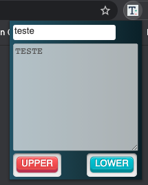

# Text Capillatizer Extension  

A little extension for Google Chrome  

## About  
This extension receive a string text in a input and modify your capitalization to lower case or upper case;  

## Usage

Just install de extension in Chrome

## View 
  

## Contributing
Pull requests are welcome. For major changes, please open an issue first to discuss what you would like to change.

Please make sure to update tests as appropriate.

## License
[MIT](https://choosealicense.com/licenses/mit/)